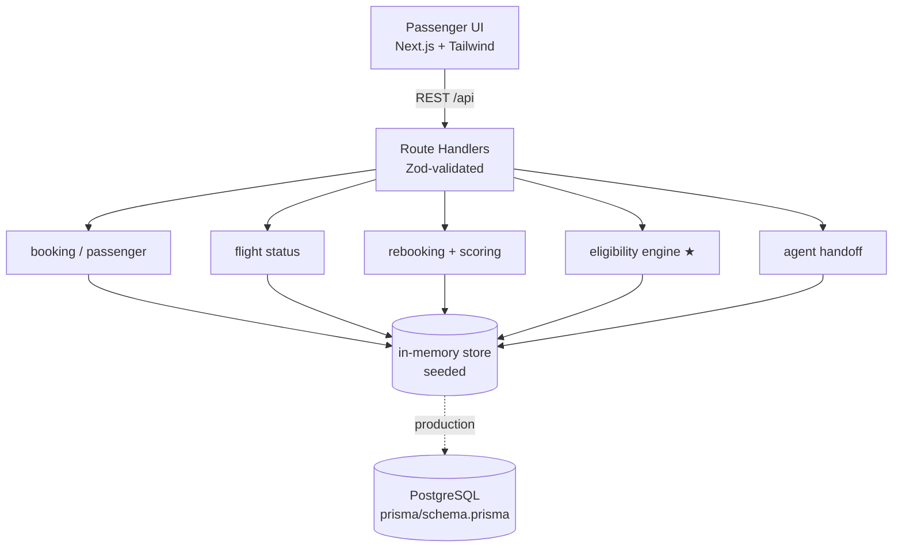

# SkyJet Flight Recovery — Self-Service for Disrupted Journeys

> **22North Product Engineering Challenge 2026 · Challenge 1**
> Design. Build. Present. — a self-service experience that lets passengers recover from weather disruptions (rebook, refund, get answers) in **under 30 seconds**, without calling the contact centre.

- **Team Name:** _<your team name>_
- **Team Members:** _<member 1>, <member 2>_
- **College:** _<college name>_

---

## The problem

SkyJet Airways (65 aircraft, Asia) sees **~40% of passengers call the contact centre** during weather disruptions just to ask three things — *Is my flight cancelled? Can I move to another flight? Am I owed a refund?* Average wait **exceeds 25 minutes**, peaking exactly when the airline is most overwhelmed.

**This MVP answers all three, self-service, in one flow** — and knows when to hand off to a human.

## What makes it different

Amadeus and Sabre build this for the *operations team*; American's consumer tool is criticised for opaque, sub-optimal options. We optimise for the **passenger**, and add the one thing none of them expose:

1. **Explainable eligibility** — every decision shows *why*, citing the actual rule (e.g. *"No cash compensation: weather is an extraordinary circumstance under DGCA CAR §3-M-IV — but you get a free rebooking, refund, and meals."*).
2. **Proactive + QR entry** — SkyJet reaches out first; a QR/deep-link drops the passenger straight into their disrupted booking.
3. **Smart, reasoned recommendation** — the best rebooking option is highlighted with a plain-English reason, not just a list.
4. **Warm agent handoff** — complex cases (minors, medical, groups) escalate *with full context attached*, so the passenger never repeats themselves.
5. **Live impact** — "calls deflected / minutes saved" shown on completion.
6. **Grounded Disruption Assistant (chatbot)** — ask a free-form question ("Am I owed a hotel?") and get an answer **grounded in SkyJet policy with citations** — no hallucination — personalised to your booking via the same eligibility engine. Runs on a two-tier engine: **semantic RAG (Gemini embeddings + Pinecone + Gemini Flash)** when configured, with a deterministic keyword-retrieval fallback so it can never dead-air.

## Try it (demo credentials)

Open the app, tap a scenario chip, or enter a PNR + last name:

| Scenario | PNR | Last name | What you will see |
|---|---|---|---|
| **Weather cancellation** | `SJ7QK2` | `Sharma` | Rebook / refund + meals, **no** cash compensation (weather) |
| **Technical cancellation** | `SJ4RM9` | `Nair` | Same, **plus ₹10,000** compensation (airline-controlled) |
| **5-hour weather delay** | `SJ8XP5` | `Mehta` | Long-delay handling, meals, no compensation |
| **Unaccompanied minor** | `SJ2MN1` | `Gupta` | **Agent handoff** with context (not automated) |

## Quick start

```bash
npm install
npm run dev        # http://localhost:3000

# other scripts
npm run build      # production build (Turbopack)
npm start          # run the production build
npm test           # unit tests: eligibility engine + assistant retrieval (Vitest)
node scripts/smoke.mjs   # end-to-end API smoke test (server must be running)
```

Requires Node 18+ (developed on Node 22). No database or API keys needed — see below.

## Technology stack

| Layer | Choice |
|---|---|
| Framework | **Next.js 16** (App Router) + **React 19** |
| Language | **TypeScript** (strict) |
| Styling | **Tailwind CSS v4** + a small custom UI kit (CVA) |
| Validation | **Zod** on every API boundary |
| Icons | lucide-react |
| Testing | **Vitest** — 70 tests across the rules engine, option scoring, assistant retrieval, the deterministic **seat map**, and the **API contract** (auth, idempotency, state machine, seat allocation) + a Node `fetch` smoke test |
| Data | In-memory seeded store (see below); **Prisma/PostgreSQL** schema documented for production |
| RAG (optional) | **Gemini** (`gemini-embedding-001` + `gemini-2.5-flash`) + **Pinecone** serverless — called over REST with native `fetch`, zero extra dependencies |
| Deploy | Vercel-ready |

## Architecture

A **modular monolith** today, structured as independently-deployable services so it can be split later without a rewrite.



**Non-functional design.** Disruptions are traffic *spikes*, so the design calls for stateless services, **cached** flight status, **async** notifications via a queue, and **idempotent** rebooking (a double-tap cannot double-book — implemented here via idempotency keys + selection re-validation). On AWS this maps to ECS/Lambda + RDS Postgres + SQS.

Full diagrams (module map, write-path sequence, booking state machine) live in [`docs/architecture.md`](docs/architecture.md); the golden path is in [`docs/customer-journey.md`](docs/customer-journey.md).

## Security & correctness

- **Every write re-authenticates** — rebook/refund/escalate require PNR **+ last name**, not just a guessable PNR. The assistant only personalises answers for a verified booking.
- **State machine enforced** — refund and rebooking are mutually exclusive (DGCA: the passenger chooses one); escalated cases are locked to the agent. Violations return `409` with a human-readable reason.
- **Idempotency keys scoped per action + booking** — a replayed key returns the stored response (`idempotent-replay: true`) with no second side effect, and can never replay a *different* operation.
- **Optimistic locking** — writes carry the booking `version`; a stale copy from another session is rejected instead of clobbering.
- **Re-rebooking releases the old seat** — changing again never leaks inventory.
- **Rate limiting** — lookups are limited to 30/min per IP (429) to blunt PNR enumeration; not-found responses never confirm whether a PNR exists.
- **Security headers** — `nosniff`, `X-Frame-Options: DENY`, referrer & permissions policies on every response.
- **Audit trail** — every lookup/rebook/refund/handoff is recorded (also powers the impact metrics).

### Why an in-memory store (not SQLite/Postgres) for the MVP

Serverless filesystems are ephemeral/read-only, so SQLite writes do not persist on a deploy. An in-memory seeded store runs **identically on a laptop and on Vercel**, with zero setup. It mirrors [`prisma/schema.prisma`](prisma/schema.prisma) 1:1 — including the optimistic-concurrency `version` and idempotency-key patterns — so swapping to Postgres is mechanical.

## The Disruption Assistant (RAG chatbot)

A layered design where **every layer is grounded** — the model can explain policy but never invent it, and the demo survives any vendor outage:

```
1. Semantic RAG        Gemini embeds the question → Pinecone finds the top policy
                       clauses → Gemini Flash writes a short answer using ONLY those
                       clauses + verified eligibility facts → citations attached.
2. Extractive          If generation fails, the top retrieved clause IS the answer
                       (verbatim, cited) — zero hallucination surface.
3. Keyword retrieval   If embeddings/Pinecone are unavailable or unconfigured,
                       the deterministic tokenise → synonym-expand → score engine
                       (src/lib/assistant.ts) answers, still with citations.
```

Design decisions worth defending aloud:

- **Pinecone stores only vector ids** — the canonical clause text lives in [`src/lib/policies.ts`](src/lib/policies.ts), so an answer can never drift from the audited corpus, and reindexing is idempotent.
- **Data minimisation** — the model receives the question, the retrieved clauses, and PII-free eligibility facts (flight number, entitlement verdicts). Never a name, PNR, or email.
- **One source of truth** — personalisation comes from the same `evaluateEligibility()` that powers the UI; the chatbot can't contradict the eligibility panel.
- **The assistant only explains — it never acts.** Rebooking/refunds stay behind the authenticated, idempotent write path.
- **Multi-turn** — the last few chat turns are passed for conversational context ("and what about a hotel?" works).
- **Ops story** — update a policy in `policies.ts`, hit `POST /api/admin/reindex` (Bearer `ADMIN_TOKEN`), and the assistant answers from the new policy. No redeploy, no prompt surgery.

**Enable it** (optional — everything else works without): copy [`.env.example`](.env.example) to `.env.local`, set `GEMINI_API_KEY`, `PINECONE_API_KEY`, and `ADMIN_TOKEN`, start the app, then index the corpus once:

```bash
curl -X POST http://localhost:3000/api/admin/reindex -H "Authorization: Bearer $ADMIN_TOKEN"
# → { "ok": true, "indexed": 13, "index": "skyjet-policies" }
```

The chat footer shows a `semantic · Gemini + Pinecone` badge when the RAG path answered; without keys it silently serves the keyword engine.

## The eligibility engine (the core)

[`src/lib/eligibility.ts`](src/lib/eligibility.ts) is a **pure, fully unit-tested** function. The rule is cross-validated by **DGCA (India)** and **Delta**: the *cause* drives entitlement.

```
Weather / ATC / security  → free rebook OR full refund + meals/hotel   ✅
                            cash compensation                          ❌ (extraordinary)
Technical / crew / ops    → the above  +  tiered cash compensation     ✅ (airline-controlled)
```

Compensation tiers follow DGCA CAR §3-M-IV block-time bands (₹5,000 / ₹7,500 / ₹10,000). Every result carries a human-readable `reason` and `ruleRef` — that is what powers the explainable UI.

## API reference

All endpoints are JSON. Writes are authenticated (PNR + last name), idempotent, and optimistically locked — full request/response examples in [`docs/api.md`](docs/api.md).

| Method | Path | Body | Purpose |
|---|---|---|---|
| POST | `/api/lookup` | `{ pnr, lastName }` | Authenticate + return booking, flight, eligibility, options, escalation (rate-limited) |
| POST | `/api/seatmap` | `{ ref, lastName, flightId }` | Authoritative seat map for a rebooking option (occupied vs. free) — used to render the airplane |
| POST | `/api/rebook` | `{ ref, lastName, flightId, seat?, idempotencyKey, expectedVersion? }` | Rebook (idempotent, re-validated, version-checked; validates the chosen seat, else auto-assigns) → new boarding pass |
| POST | `/api/refund` | `{ ref, lastName, idempotencyKey, expectedVersion? }` | Initiate refund → reference number (no payment integration) |
| POST | `/api/escalate` | `{ ref, lastName }` | Warm handoff to an agent with a context summary (re-asking joins the same case) |
| POST | `/api/assist` | `{ query, ref?, lastName?, history? }` | Grounded chatbot answer + citations (RAG when configured, keyword fallback; personalised only for a verified booking) |
| POST | `/api/admin/reindex` | — (Bearer `ADMIN_TOKEN`) | Embed + upsert the policy corpus into Pinecone (idempotent) |
| GET | `/api/stats` | — | Impact metrics (calls deflected, minutes saved) |
| POST | `/api/reset` | — | Reseed the demo store |

## Key assumptions

- Passenger/flight data is **mocked** with realistic, deterministic seed data (pinned to a fixed "disruption day" in IST).
- **No payment integration** (per brief) — refunds issue a reference number.
- Lightweight auth: **PNR + last name** (production would use OTP / an IdP).
- Rebooking **settles the fare difference** vs. the original fare paid — a pricier flight charges the difference, a cheaper one refunds it (shown on the flight cards, the seat-selection step, and the boarding-pass screen).
- Thresholds: long delay ≥ 3h; meals ≥ 2h; hotel ≥ 6h (overnight).

## Deliberately deferred (future work)

Real payments & auth, live GDS/PSS inventory, partner/interline rebooking, predictive (pre-disruption) alerts, a **deeper RAG stack** for the assistant (dedicated reranker, multi-corpus fare/partner rules, admin upload UI — the current semantic tier covers embeddings + vector search + grounded generation), event-driven microservices (Kafka + saga + outbox), and recovery-KPI analytics. Scope was cut on purpose to ship one polished end-to-end journey — see [`../docs/features.md`](../docs/features.md) for the full prioritised backlog.

## AI tools used (disclosure)

Built with **Claude / Claude Code** (per challenge rules) for competitor & regulatory research synthesis, scaffolding, code generation, and documentation. All architecture, product decisions, the eligibility rules, and final code were directed and reviewed by the team.

## Project structure

```
skyjet-recovery/
├── src/
│   ├── app/
│   │   ├── page.tsx              # renders the recovery app
│   │   └── api/                  # lookup · rebook · refund · escalate · assist · stats · reset · admin/reindex
│   │       └── routes.test.ts    # API contract tests (auth, idempotency, state machine)
│   ├── components/
│   │   ├── recovery-app.tsx      # the golden-path UI + grounded assistant (client)
│   │   └── ui/                   # Button, Card, Badge
│   └── lib/
│       ├── eligibility.ts        # ★ rules engine (+ eligibility.test.ts)
│       ├── assistant.ts          # keyword policy retrieval — fallback tier (+ assistant.test.ts)
│       ├── rag/                  # semantic tier: Gemini embeddings + Pinecone + grounded generation (+ rag.test.ts)
│       ├── policies.ts           # curated policy knowledge base (single source of clause truth)
│       ├── service.ts            # rebooking scoring, escalation, booking view (+ service.test.ts)
│       ├── store.ts              # in-memory seeded store
│       ├── seed.ts               # deterministic scenarios
│       ├── ratelimit.ts          # lookup rate limiting (anti-enumeration)
│       ├── format.ts             # IST-pinned formatting
│       └── types.ts
├── docs/
│   ├── architecture.md           # diagrams: modules, write path, state machine, NFR (deliverable)
│   ├── customer-journey.md       # golden path + automate-vs-escalate (deliverable)
│   ├── api.md                    # full API design & examples (deliverable)
│   └── deck-outline.md           # ≤10-slide deck skeleton with speaker notes
├── prisma/schema.prisma          # production data model (deliverable)
└── scripts/smoke.mjs             # end-to-end API smoke test
```

Research behind the product decisions lives in [`../research/`](../research/) and the [`flight-recovery-mvp` skill](../.claude/skills/flight-recovery-mvp/).
