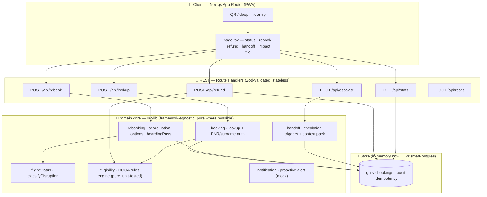
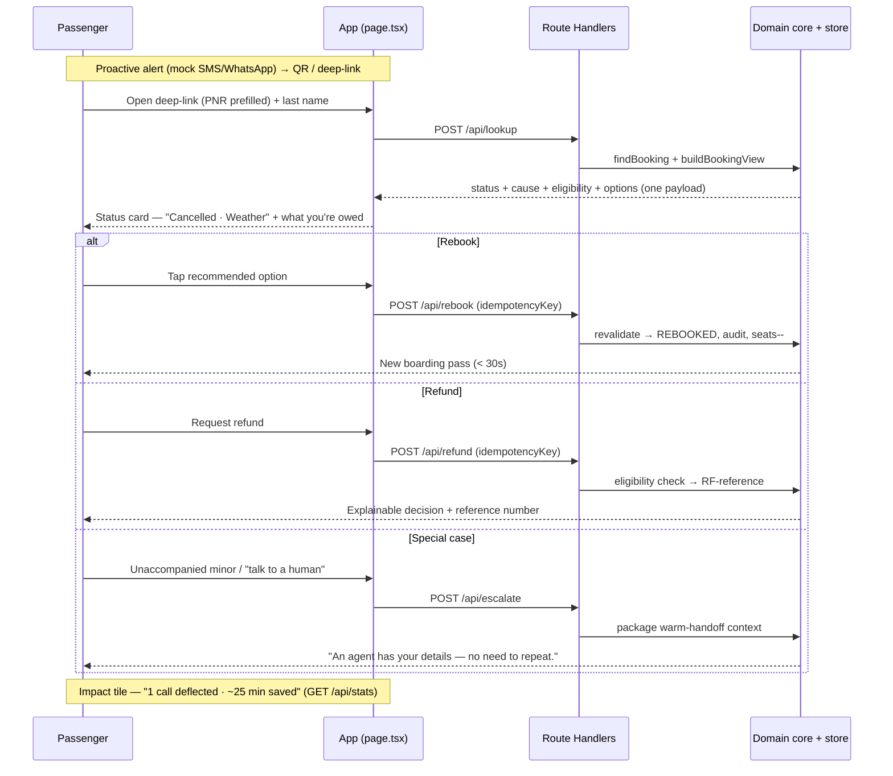

# SkyJet Flight Recovery — Architecture & Design

> 22North Product Engineering Challenge 2026 · Challenge 1 (PS1).
> Primary design deliverable — covers **architecture diagram · module design · data model · API reference · customer journey · NFR story · key assumptions**. Grounded in the actual codebase (`skyjet-recovery/`), not aspirational. Feature scope lives in [features.md](features.md); background in the [flight-recovery-mvp skill](../.claude/skills/flight-recovery-mvp/SKILL.md).

**The one-liner:** *A focused, explainable version of what Amadeus and Sabre sell to airlines — proactive, self-service disruption recovery, optimized for the passenger, not just the ops team.*

---

## 1. System overview

SkyJet passengers hit a weather/technical disruption and self-serve the three questions that flood the contact center — *Is my flight cancelled? · Can I move to another flight? · Am I owed a refund?* — resolving in **< 30 seconds** instead of a **> 25-minute** hold. High-frequency, low-risk decisions are **automated**; high-risk, low-frequency ones get a **warm agent handoff** carrying full context.

- **Client:** Next.js 14 App Router, React, Tailwind + shadcn/ui — one mobile-first PWA-style page (`src/app/page.tsx`) that walks the golden path.
- **Server:** Next.js Route Handlers (`src/app/api/*`) — a thin REST layer over a **domain core** (`src/lib/*`). Input validated with **Zod**; every response is typed.
- **Data:** an in-memory **seeded store** (`src/lib/store.ts`) for the demo, mirroring a production **PostgreSQL/Prisma** model 1:1 (`prisma/schema.prisma`) — including the optimistic-`version` and idempotency-key columns, so the swap is mechanical.

Design values, in priority order: **explainability everywhere · a flawless golden path · defensible-aloud decisions.**

---

## 2. Architecture

A **modular monolith today, microservices-ready on paper.** The `src/lib` domain is split into six cohesive service modules with no cross-imports of transport concerns — each could become an independently deployable service without touching business logic.



**Why modular monolith for a 1-day build:** one deployable, one process, zero infra to provision — the demo runs identically on a laptop and on Vercel serverless. The module seams (not a big ball of mud) are what make the "microservices-ready" story credible when a judge asks *"how does this scale?"* — you point at the six modules and the async-notification seam, not a rewrite.

### Module responsibilities

| Module | File(s) | Responsibility | Deployable-as |
|--------|---------|----------------|---------------|
| **booking** | `store.ts` (`findBooking`), `lookup/route.ts` | PNR + surname lookup; assemble the booking view | `booking-service` |
| **flightStatus** | `eligibility.ts` (`classifyDisruption`), `store.ts` | Classify CANCELLED / LONG_DELAY; expose route inventory | `flight-status-service` (cache-fronted) |
| **rebooking** | `service.ts` (`scoreOption`, `getRebookingOptions`, `makeBoardingPass`), `rebook/route.ts` | Scored alternatives + recommended pick; idempotent rebook; boarding pass | `rebooking-service` |
| **eligibility** | `eligibility.ts` | The DGCA rules engine — refund / rebook / compensation / duty-of-care with reasons + rule refs | `eligibility-service` (pure) |
| **handoff** | `service.ts` (`evaluateEscalation`), `escalate/route.ts` | Detect out-of-policy cases; package warm-handoff context | `handoff-service` |
| **notification** | UI + mock | Render the proactive alert that *would* be sent (deep link + held seat) | `notification-service` (async/queue) |

---

## 3. Data model

Runtime uses `src/lib/store.ts` (in-memory Maps seeded from `src/lib/seed.ts`); it mirrors `prisma/schema.prisma` field-for-field. Core entities:

- **Flight** — `flightNo`, route (`origin/destination` + cities), `departure/arrival` (ISO UTC), `durationMin`, `status` (SCHEDULED/CANCELLED/DELAYED), `cause` (WEATHER/ATC/SECURITY/TECHNICAL/CREW/OPERATIONAL/NONE), `delayMinutes`, `seatsAvailable`. Indexed on `(origin, destination, status, departure)` — the query a disruption spike hammers.
- **Passenger** — name, masked `email`, `tier` (STANDARD/SILVER/GOLD).
- **Booking** — `ref` (PNR, PK), `flightId` (+ optional `connectingFlightId`), `status` (CONFIRMED → DISRUPTED → REBOOKED / REFUND_REQUESTED / ESCALATED), `fareClass`, `farePaid` (INR), `specialFlags[]`, `partySize`, mutation trail (`rebookedFlightId`, `refundReference`, `handoffReference`), and **`version`** for optimistic concurrency.
- **AuditEntry** — `bookingRef`, `action` (LOOKUP/REBOOK/REFUND/ESCALATE/ACKNOWLEDGE), `detail`, `before`/`after`, and a **`idempotencyKey` unique** column for race-safe, replayable writes.

> The Prisma schema **is** the DB-schema deliverable. The in-memory store additionally keeps an `idempotency` map (key → stored JSON response) so a warm process replays writes exactly.

---

## 4. API reference

REST over JSON. All mutating endpoints are `POST`; validation via Zod; errors are `{ error: string }` with a correct HTTP status. Write endpoints (`/rebook`, `/refund`) take a client-generated `idempotencyKey`.

### `POST /api/lookup` — identify & load
Auth is **PNR + last name** (both must match — `store.findBooking`).
```jsonc
// req
{ "pnr": "SJ7QK2", "lastName": "Sharma" }
// 200 → BookingView (see §4.1);  404 → { error: "...(Try SJ7QK2 / Sharma.)" }
```

### `POST /api/rebook` — confirm a new flight (idempotent, race-safe)
```jsonc
// req
{ "ref": "SJ7QK2", "flightId": "SJ456-...", "idempotencyKey": "<uuid>" }
```
- **Replay:** if `idempotencyKey` was seen → returns the **stored** payload, `200` + header `idempotent-replay: true`.
- **Revalidation:** the chosen `flightId` must still be in freshly-computed options, else **`409`** ("no longer available"). This is why a stale tab or a race can't double-book.
- **Success:** decrement `seatsAvailable`, set `status=REBOOKED`, `version++`, audit REBOOK (before/after flight), cache the payload, return **`201`** with `{ ...BookingView, boardingPass, stats }`.

### `POST /api/refund` — request a refund (idempotent)
```jsonc
{ "ref": "SJ7QK2", "idempotencyKey": "<uuid>" }
```
Checks `eligibility.refund.eligible` (**`409`** if not). On success: issue reference `RF-XXXXXX`, `status=REFUND_REQUESTED`, `version++`, audit REFUND, return `201` `{ ...BookingView, refund: { reference, amount }, stats }`. **No payment integration — reference number only.**

### `POST /api/escalate` — warm agent handoff
```jsonc
{ "ref": "SJ7QK2" }
```
Sets `status=ESCALATED`, issues `AG-XXXXXX`, and returns a **handoff context pack** — passenger, PNR, tier, the flight+cause line, the escalation reasons, and "used self-service before escalating — context attached" — so the agent never asks the passenger to repeat themselves.

### `GET /api/stats` — impact tile
Returns `{ rebooks, refunds, escalations, selfServed, callsDeflected, minutesSaved }`, derived from the audit log (`minutesSaved = selfServed × 25`, the avg contact-center hold).

### `POST /api/reset` — restore seed state (demo control).

#### 4.1 `BookingView` (the shared response envelope)
`buildBookingView()` returns everything the client needs in one shot — no chatty round-trips:
```ts
{ booking, flight, rebookedFlight?, eligibility: EligibilityResult,
  escalation: { escalate, reasons[] }, options: RebookOption[] }
```

---

## 5. The eligibility engine (the crown jewel)

`src/lib/eligibility.ts` — **pure, deterministic, unit-tested** (`eligibility.test.ts`). The defensible rule, cross-validated by **DGCA (India)** and **Delta**: *the cause of the disruption drives entitlement.*

```
classifyCause:  WEATHER | ATC | SECURITY      → EXTRAORDINARY
                TECHNICAL | CREW | OPERATIONAL → AIRLINE_CONTROLLED

IF disrupted (CANCELLED, or DELAYED ≥ 180 min):
   refund   = full farePaid            ✅ (passenger's choice)
   rebook   = free, no fare difference ✅
   dutyOfCare.meals = cancelled OR delay ≥ 120 min
   dutyOfCare.hotel = delay ≥ 360 min
   IF cause = AIRLINE_CONTROLLED:
       compensation = tier(durationMin)  ✅  (≤60→₹5,000 · ≤120→₹7,500 · else ₹10,000)
   ELSE (EXTRAORDINARY):
       compensation = ₹0                 ❌  "extraordinary circumstance"
```

Every field carries a **human-readable reason** and a **rule citation** (`DGCA CAR §3-M-IV`). That's the differentiator: the product doesn't just decide, it *explains* — *"No cash compensation: weather is an extraordinary circumstance beyond the airline's control. You're still entitled to a free rebooking or full refund, plus meals and a hotel."* This is the direct answer to American's tool being criticized as opaque, and — deliberately — the **opposite** of a shallow hardcoded `if/elif` table (the AeroMind repo's mistake).

**Rebooking recommendation** (`service.ts`, ben-marrett-inspired): each candidate starts at 100, −30 next-day, −5/h later (cap −40), +10 if within 2h of the original time-of-day; top-scored is flagged `recommended` with a plain-English reason (*"Same day · 3h later · direct"*). Options are recomputed live from inventory, so a shown option is never stale.

**Escalation** (`evaluateEscalation`): special flags (unaccompanied minor, medical, pet, group, partner ticket), party size > 4, or **no valid self-service rebooking** → route to an agent.

---

## 6. Customer journey (the golden path)



The ~90-second demo: **proactive alert → identified status card → recommended rebook → boarding pass**, with the **refund** and **agent-handoff** branches shown, closing on the **impact tile**.

---

## 7. Non-functional story (scores the 15% bucket)

Disruptions are **traffic spikes** — everyone asks the same three questions at once. The design answers that:

| Concern | In this MVP | Production mapping |
|---------|-------------|--------------------|
| **Statelessness** | Route handlers hold no state; store is a module singleton on `globalThis` | Stateless services behind a load balancer (ECS/Lambda) |
| **Read spikes** | `flightStatus` reads are cheap; route index modelled | Cache flight status (Redis/CDN); read replicas |
| **Race-safe writes** | Idempotency-key replay + optimistic `version` + revalidate-vs-fresh-options | Same keys enforced by a DB unique constraint |
| **Async fan-out** | Notification is a mock "would-send" | Queue (SQS/Kafka) + outbox + DLQ (irinakomarchenko pattern) |
| **Auditability** | Every mutation writes an `AuditEntry` (before/after, action) | Append-only audit table; PII redaction |
| **Deterministic demo** | All time formatting pinned to `Asia/Kolkata` (`format.ts`) | Explicit tz handling everywhere |
| **Typed contracts** | Zod at every boundary; typed `{ error }` responses | RFC-7807 problem+json |

---

## 8. Engineering patterns borrowed (from the 9-repo research)

| Pattern | Source repo | Where it lives here |
|---------|-------------|---------------------|
| Idempotency-key replay + revalidate selection vs fresh options | **ben-marrett/flight-rebooking-service** | `rebook/route.ts` |
| Scored options (start 100, adjust) + plain-English reason | **ben-marrett** | `service.ts` `scoreOption` |
| Adapter → one normalized booking view, no chatty reads | **pnrsh** | `buildBookingView` |
| Tiered legal compensation, cause-driven | **ROADEF (EU261)** + DGCA | `eligibility.ts` `compensationTier` |
| Warm handoff / "authority in human + DB, never the model"; audit | **oneairagent** | `escalate/route.ts`, `AuditEntry` |
| Business-rules-as-pipeline for compensation | **kumarmanish/AirlinesEventPublisher** | eligibility framing |
| Delay propagation along rotation (deferred / future) | **konczyk/irrops** | Future-work slide |
| Full-stack demo shape — *and what NOT to hardcode* | **deekshitaa1/AeroMind-AI** | cautionary: rules engine is reasoned, not `if/elif` |

---

## 9. Key assumptions

- **Mock data**; realistic seed (`seed.ts`) — a handful of bookings incl. the demo pair `SJ7QK2 / Sharma`.
- **Auth** = PNR + last name (optional OTP is future work); no real IdP.
- **No payments** — refund and compensation issue a **reference number** only.
- **Airline-caused disruption ⇒ no fare difference** on rebooking (stated on-screen).
- Thresholds: **long delay = 180 min**, **meals ≥ 120 min**, **hotel ≥ 360 min**, **compensation tiers ₹5,000 / ₹7,500 / ₹10,000** by block time (`DGCA CAR §3-M-IV`). *Verify the current DGCA CAR before quoting tiers as legal fact in the deck.*
- Rebooking inventory = **same-route, SCHEDULED, seats > 0, departing at/after the original**, recomputed live.
- In-memory store resets on cold start / `POST /api/reset`; production is the Prisma/Postgres schema.

---

## 10. Explicitly deferred (deliberate scoping — say so in the deck)

Real payments · real auth/SSO · live inventory · partner/interline/award rebooking · loyalty redemption · multi-language · predictive (pre-disruption) alerts · cost/OR-optimized selection · cascading delay propagation · event-driven microservices (the scale architecture behind the monolith). Each belongs on the **Future Work** slide — deferring on purpose is a scored signal of product judgment.

*Compiled 2026-07-02 from the live `skyjet-recovery/` codebase. Keep in sync if endpoints or the rules engine change.*
