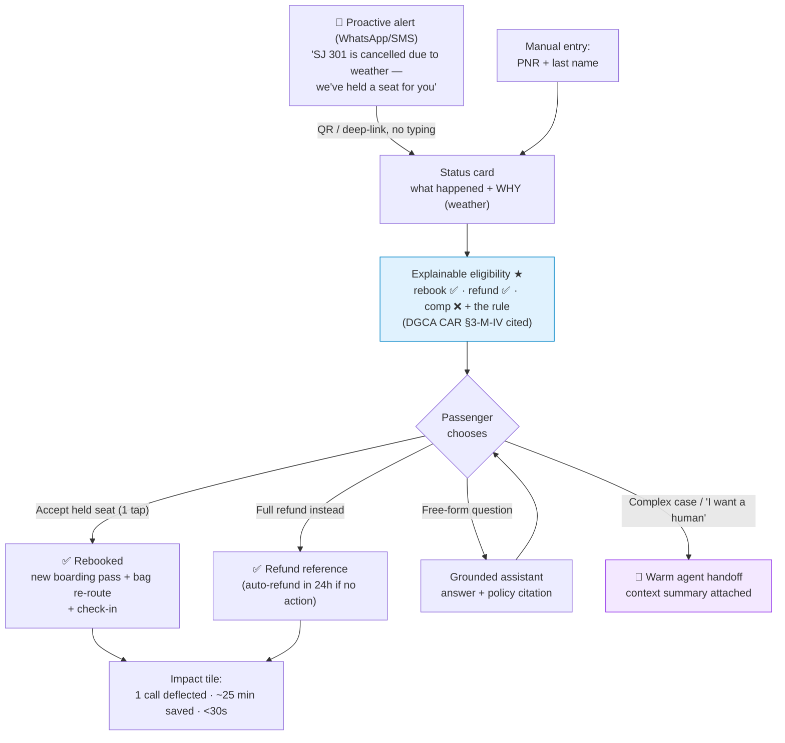
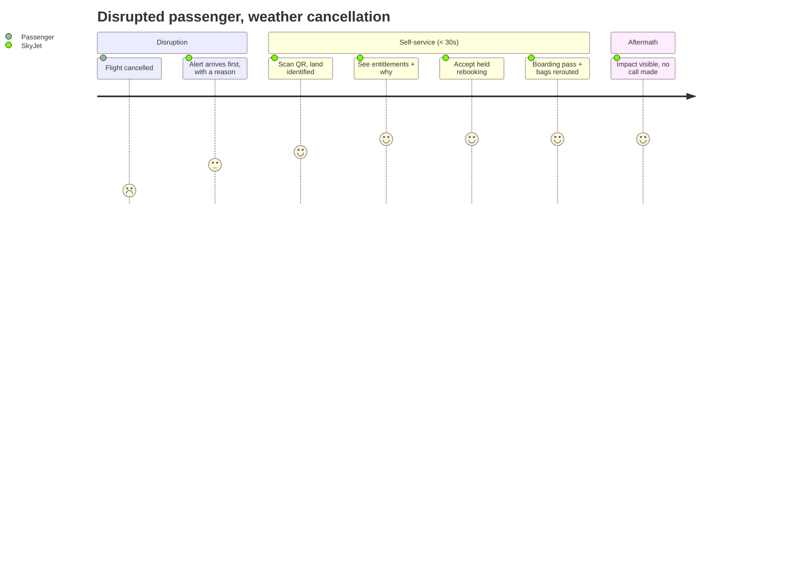

# Customer Journey — SkyJet Flight Recovery

> Deliverable: customer journey diagram. The "golden path" resolves the three questions that drive 40% of contact-centre calls — *Is my flight cancelled? Can I move to another flight? Am I owed a refund?* — in under 30 seconds.

## Before vs after

| | Today (phone) | With self-service |
|---|---|---|
| Learn about the disruption | Airport screen / rumour | **Proactive alert** with the reason, entitlements, and a QR deep-link |
| Get answers | >25-min hold | Status + explainable eligibility on one screen |
| Rebook | Agent does it | One tap on a **pre-held, recommended** option → boarding pass |
| Refund | Agent files it | One tap → reference number (auto-refund in 24h if no action) |
| Complex case | Repeat story to each agent | **Warm handoff** — agent already has full context |

## The golden path

## Journey emotions (why each beat exists)

## Automate vs escalate (the product decision)

| Case | Route | Why |
|---|---|---|
| Cancellation / delay ≥ 3h, standard booking | **Automate** | High-frequency, low-risk — rules engine decides, passenger confirms |
| Refund/compensation eligibility | **Automate** | Deterministic DGCA rules; explanation builds trust |
| Unaccompanied minor, medical, pets | **Escalate** | Duty-of-care risk — a human must own it |
| Groups > 4 / partner-airline tickets | **Escalate** | Multi-party / out-of-system constraints |
| No valid rebooking within policy | **Escalate** | Don't dead-end the passenger |
| Passenger asks for a human | **Escalate** | Always available, on every screen |

Every escalation is a **warm handoff**: case reference + flight context + what the passenger already tried, so they never repeat themselves.

## Demo scenarios (seeded)

| # | PNR / name | Scenario | What it demonstrates |
|---|---|---|---|
| 1 | `SJ7QK2` / Sharma | DEL→BKK cancelled, **weather** | Golden path; comp **not** owed — and the why |
| 2 | `SJ4RM9` / Nair | BOM→SIN cancelled, **technical** | Same flow, **+ ₹10,000 comp** (airline-controlled) |
| 3 | `SJ8XP5` / Mehta | BLR→DXB **5h delay**, weather | Long-delay threshold, meals entitlement |
| 4 | `SJ2MN1` / Gupta | Unaccompanied **minor** on cancelled flight | Escalation triggers + warm handoff |
